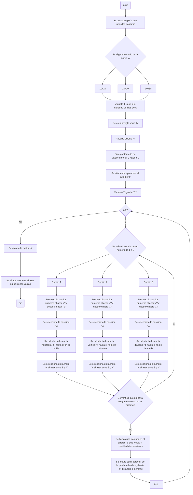

# Projecto_programacion

## Definición de alternativa

## Diagrama preliminar


## Solución preliminar
Primero, se crearon 6 funciones principales antes de realizar un codigo general. La primera función consiste en crear una matriz con cualquier tamaño.
```python
def crear_matriz(n: int) -> list:
    # Crea una matriz n x n donde cada elemento es una cadena vacía
    return [["" for i in range(n)] for i in range(n)]
```
La segunda función filtra y añade a una lista solo las palabras que caben en la matriz.
```python
def filtrar_palabras(Todas:list,tamaño_mtr:int)->list: 
  filtradas = []  #Se crea una lista vacia para guardar las palabras filtradas
  for i in Todas: #Se recorre la lista de palabras
    if len(i) <= tamaño_mtr: #Si la longitud de la palabra es menor o igual al tamaño de la matriz
      filtradas.append(i) #Se añade la palabra a la lista filtradas
  return filtradas 
```
La tercera y cuarta función verifican si hay algún objeto distinto de una cadena vacía en un rango dentro de una fila o columna. Esto para saber si se puede añadir una palabra.
```python
def verf_vacios_hor(A:list,x:int,y:int,d:int) ->bool: #Se añaden los parametros de la matriz, la fila, la columna y la longitud de la palabra
  Vacios = False  #Se asigna a Vacios el valor de False
  for i in range(y,y+d): #Se recorre la fila por la longitud de la palabra
    if A[x][i] != "": #Si la matriz en la fila x y la columna i es diferente de vacio
      Vacios=True  #Se asigna a Vacios el valor de True y se rompe el ciclo
      break
  return Vacios

def verf_vacios_ver(A:list,x:int,y:int,d:int)->bool:
  Vacios = False #Se asigna a Vacios el valor de False
  for i in range(x,x+d): #Se recorre la columna por la longitud de la palabra
    if A[i][y] != "": #Si la matriz en la fila i y la columna y es diferente de vacio
      Vacios=True  #Se asigna a Vacios el valor de True y se rompe el ciclo
      break
  return Vacios 
```
La quinta y sexta función añaden una cadena, caracter por caracter, a un rango dentro de una fila o columna, respectivamente.
```python
def añadir_palabra_horz(A:list,s:str,fila:int,columna:int)->list: #Se añaden como parametros la matriz, la palabra, la fila y la columna
    i = fila #Se asigna a i el valor de la fila, ya que la fila no cambia
    for k in range(columna,columna + len(s)):  #Se recorre la palabra y la fila.
        A[i][k] = s[k-columna] #Se asigna a la matriz la letra de la palabra en la posicion k-columna
    return A  

def añadir_palabra_ver(A:list,s:str,fila:int,columna:int)->list:
  i = columna #Se asigna a i el valor de la columna, ya que la columna no cambia
  for k in range(fila,fila + len(s)):  #Se recorre la palabra y la columna.
    A[k][i] = s[k - fila] #Se asigna a la matriz la letra de la palabra en la posicion k-fila
  return A  
```
Después se añadieron todas las funciones a un codigo principal.
### El usuario selecciona nivel de dificultad 
```python
print("Seleccione nivel de dificultad:\n 1.Facil 10x10 \n 2.Medio 20x20 \n 3.Dificil 30x30")  #Se le pide al usuario que seleccione el nivel de dificultad
Dificultad: int =int(input("Escriba 1, 2 , 3: ")) #Se guarda la respuesta del usuario en la variable Dificultad
A = cr.crear_matriz(Dificultad * 10) #Se crea la matriz dependiendo de la dificultad seleccionada por el usuario
Tamaño_matriz :int = len(A) #Se guarda el tamaño de la matriz en la variable Tamaño_matriz #Se crea una lista con las palabras filtradas
Cantidad_de_palabras :int = Tamaño_matriz // 2  #Se seleccionan la cantidad de palabras que se van a añadir a la matriz
```
### Se añaden las palabras a la matriz
```python
#Se añaden palabras horizontalmente.

Palabras_dentro = []
while Cantidad_de_palabras > 0: #Mientras la cantidad de palabras sea mayor a 0
  Opciones = random.randint(1,3)  #Se selecciona una opcion aleatoria
  if Opciones == 1: #Si la opcion es 1, la palabra se añade horizontalmente
    coordenada_x = random.randint(0,Tamaño_matriz-3) #Se selecciona una coordenada x aleatoria
    coordenada_y = random.randint(0,Tamaño_matriz-3) #Se selecciona una coordenada y aleatoria

    distancia_x = Tamaño_matriz - coordenada_y  #Se calcula la distancia en x hasta el final de la fila
    N_letras = random.randint(3,distancia_x) #Se selecciona un numero aleatorio de letras entre 3 y la distancia en x
    Vacio = verf.verf_vacios_hor(A,coordenada_x,coordenada_y,N_letras) #Se verifica si hay espacio para añadir la palabra
    
    if Vacio == False: #Si hay espacio:
      Palabra_seleccionada = ""  #Se crea una cadena vacia para guardar la palabra seleccionada
      Palabra_seleccionada = random.choice(Palabras_filtradas) #Se selecciona una palabra aleatoria
      if len(Palabra_seleccionada) == N_letras:  #Si la longitud de la palabra seleccionada es igual a un numero aleatorio N_letras
        Palabras_dentro.append(Palabra_seleccionada) #Se añade la palabra a la lista de palabras dentro
        Palabras_filtradas.remove(Palabra_seleccionada) #Se remueve la palabra de la lista de palabras filtradas
        an.añadir_palabra_horz(A,Palabra_seleccionada,coordenada_x,coordenada_y) #Se añade la palabra a la matriz usando como parametros la matriz, la palabra, la fila y la columna  
        Cantidad_de_palabras-=1 #Se resta 1 a la cantidad de palabras que se van a añadir a la matriz

#Se añaden palabras verticalmente.

  elif Opciones == 2: #Si la opcion es 2, la palabra se añade verticalmente
    coordenada_x = random.randint(0,Tamaño_matriz-3) #Se selecciona una coordenada x aleatoria
    coordenada_y = random.randint(0,Tamaño_matriz-3) #Se selecciona una coordenada y aleatoria

    distancia_y= Tamaño_matriz-coordenada_x #Se calcula la distancia en y hasta el final de la columna
    N_letras= random.randint(3,distancia_y) #Se selecciona un numero aleatorio de letras entre 3 y la distancia en y
    Vacio = verf.verf_vacios_ver(A,coordenada_x,coordenada_y,N_letras) #Se verifica si hay espacio para añadir la palabra
    if Vacio == False: #Si hay espacio:
      Palabra_seleccionada = "" #Se crea una cadena vacia para guardar la palabra seleccionada
      Palabra_seleccionada = random.choice(Palabras_filtradas) #Se selecciona una palabra aleatoria
      if len(Palabra_seleccionada) == N_letras: #Si la longitud de la palabra seleccionada es igual a un numero aleatorio N_letras
        Palabras_dentro.append(Palabra_seleccionada) #Se añade la palabra a la lista de palabras dentro
        Palabras_filtradas.remove(Palabra_seleccionada) #Se remueve la palabra de la lista de palabras filtradas
        an.añadir_palabra_ver(A,Palabra_seleccionada,coordenada_x,coordenada_y) #Se añade la palabra a la matriz usando como parametros la matriz, la palabra, la fila y la columna 
        Cantidad_de_palabras-=1 #Se resta 1 a la cantidad de palabras que se van a añadir a la matriz
```
### Se remplazan letras aleatorias por los espacios vacios y se imprime la matriz
```python
for i in range(len(A)): #Se recorren las filas
  for j in range(len(A[i])): #Se recorren las columnas
    if A[i][j] == "": #Si la matriz en la fila i y la columna j es igual a una cadena vacia
      A[i][j] = random.choice("ABCDEFGHIJKLMNOPQRSTUVWXYZ") #Se selecciona una letra aleatoria y se añade a la matriz
#Se imprime la matriz
for i in range(len(A)):#Se recorren las filas
  print(A[i]) #Se imprime cada fila
```
### El usuario ingresa las palabras que encuentre 
```python
while len(Palabras_dentro) > 0: #Mientras la longitud de la lista de palabras dentro de la matriz sea mayor a 0
    Intento = input("Ingrese la palabra que encuentre: ") #Se le pide al usuario que ingrese una palabra
    if Intento.upper() in Palabras_dentro: #Si la palabra ingresada por el usuario esta en la lista de palabras dentro
      print("Palabra correcta") #Se imprime que la palabra es correcta
      Palabras_dentro.remove(Intento.upper()) #Se remueve la palabra de la lista de palabras dentro
if len(Palabras_dentro) == 0: #Si la longitud de la lista de palabras dentro es igual a 0
  print("Se han encontrado todas las palabras") #Se imprime que se han encontrado todas las palabras
```
