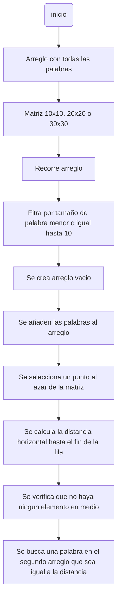

# Projecto_programacion

### Definición de alternativa

### Diagrama preliminar

```mermaid
flowchart TD
  A(inicio)-->B[Arreglo con todas las palabras]
  B-->C[Matriz 10x10. 20x20 o 30x30]
  C-->D[Recorre arreglo]
  D-->E[Fitra por tamaño de palabra menor o igual hasta 10]
  E-->F[Se crea arreglo vacio]
  F-->G[Se añaden las palabras al arreglo]  
  G-->H[Se selecciona un punto al azar de la matriz]
  H-->I[Se calcula la distancia horizontal hasta el fin de la fila]
  I-->J[Se verifica que no haya ningun elemento en medio]
  J-->K[Se busca una palabra en el segundo arreglo que sea igual a la distancia]
```

### Solución preliminar

